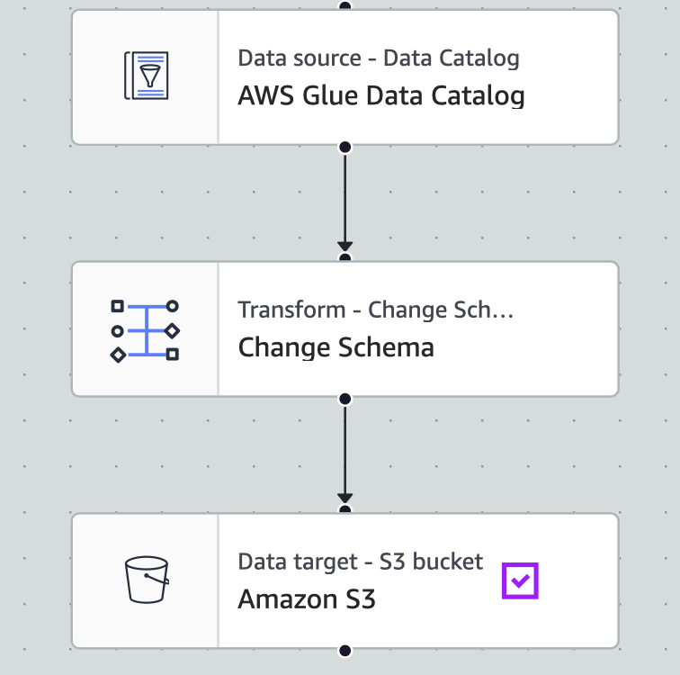
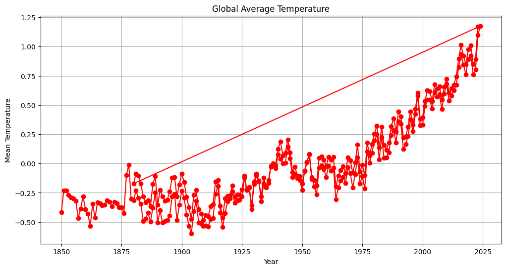

# Mini AWS Data Pipeline Project

## Descrição do Projeto
Este projeto demonstra um mini pipeline de dados utilizando serviços AWS e Python, com o objetivo de transformar, consultar e visualizar dados de forma simples e eficiente.

- **Dados brutos** armazenados no S3  
- **Transformações** realizadas com AWS Glue  
- **Consultas** via Athena  
- **Visualização final** em Python/Matplotlib (substituindo QuickSight devido a limitações da conta)  

> O portefólio inclui:  
> - Queries utilizadas no Athena  
> - Print do Visual ETL no AWS Glue  
> - Script Python (`data_pipeline_notebook.ipynb`)  
> - CSV processado do S3

---

## Arquitetura do Pipeline

- **S3 (raw)**: armazenamento dos dados originais (CSV)  
- **Glue**: transformação e limpeza de dados  
- **S3 (processed)**: dados transformados prontos para análise  
- **Athena**: consultas SQL sobre os dados processados  
- **Python/Matplotlib**: visualização dos resultados

>   
> *Print do job visual no AWS Glue mostrando o fluxo de transformação dos dados.*

---

## Athena Queries

As queries usadas no projeto estão em `athena_queries/`.  
Exemplos:

- `average_temperature.sql` → calcula média de temperatura por século  
- `top5_years.sql` → top 10 anos mais quentes  

> Estas queries mostram que os dados processados no S3 podem ser consultados diretamente via Athena.

---

## Dados de Exemplo

| Source | Year | Mean    |
|--------|------|---------|
| gcag   | 1850 | -0.4177 |
| gcag   | 1851 | -0.2333 |
| gcag   | 1852 | -0.2294 |
| gcag   | 1853 | -0.2704 |
| gcag   | 1854 | -0.2915 |


---

## Visualização

Gráfico da temperatura média global (1850–2025):



> O gráfico mostra a variação da temperatura média ao longo dos anos. Foi gerado com Python/Matplotlib, substituindo o QuickSight.

---

## Notebook

- O notebook `data_pipeline_notebook.ipynb` contém todo o código necessário para reproduzir o gráfico.  
- Basta abrir no [Google Colab](https://colab.research.google.com/) e fazer upload do arquivo `processed/weather_data.csv` para gerar os gráficos.

---

## Como Usar

1. Clone o repositório:

```bash
git clone https://github.com/TEU_USUARIO/aws-data-pipeline-mini.git
cd aws-data-pipeline-mini
